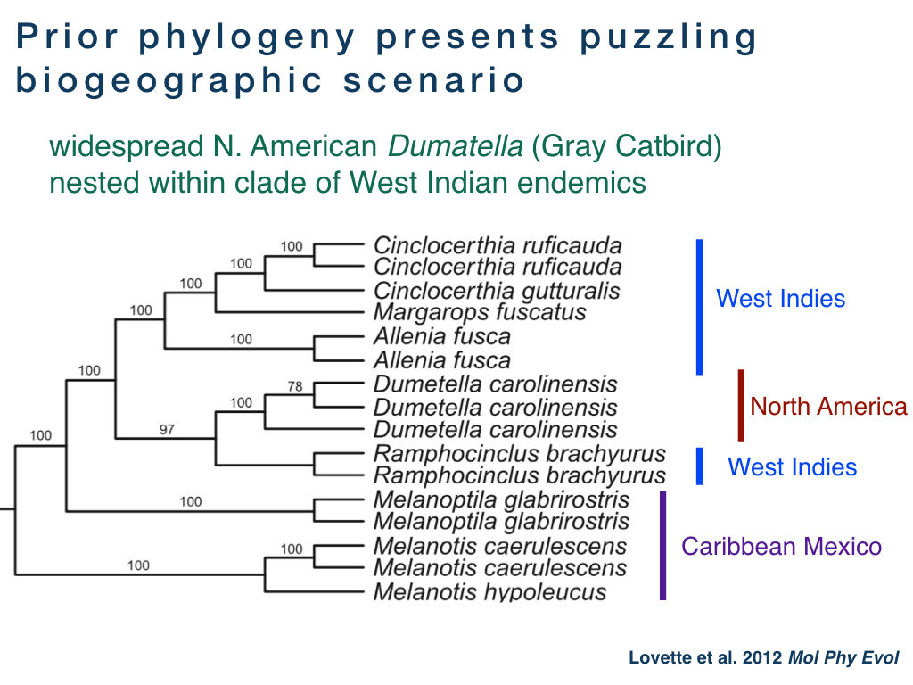

##authors
Matthew Miller, Villanova University
Jeff DaCosta, Boston University
Jen Mortenson, Tufts University
Michael Sorenson, Boston University
Robert Curry, Villanova University
Michael Reed, Tufts University

## overview
Nine species of trembers and thrashers (Aves: Mimidae) are found in the West Indies and adjacent Caribbean mainland. Five of the nine species are West Indian endemics, and one species (*Ramphocinclus brachyurus*) is endemic to the islands of St. Lucia and Martinique in the Lesser Antilles where they persist in threatened populations of only a few hundred (Martinique) or a few thousand birds (St. Lucia). 

Two previous studies ([Hunt et al. 2001](http://stri.si.edu/sites/publications/PDFs/2001_Hunt_Bermingham_wRicklefs_35-55.pdf) and [Lovette et al. 2012](http://www.sciencedirect.com/science/article/pii/S1055790311003320)) have attempted to reconstruct the biogeographic history of the West Indian thremblers and thrashers. However, the results of these studies are inconsistent, Furthermore, some phylogenetic trees from Lovette et al. suggest that the North America Gray Catbird (*Dumatella carolinensis*) is embeded within a clade of Lesser Antillean endemic taxa, which presents a puzzling biogeographic scenario – how did a small endemic island bird population colonize North America without leaving any populations elsewhere in the Caribbean?

The goal of our study was to use a genome wide data to provided an improved phylogeny of the tremblers and thrashers. Additionally, Jen Mortenson obtained genetic material from the Martinique population of *Ramphocincla brachyura*, and our second goal was to see if genomic data could support recognition of this population as a distinct species relative to the St. Lucia population (*Ramphocinclus sanctaeluciae*).

##results
We used dd-RAD-Seq to generate a reduce genomic dataset for phylogenetic analyses. Following the pipeline of [DaCosta et al. 2014](http://journals.plos.org/plosone/article?id=10.1371/journal.pone.0106713). This approach generated over 274,000 basepairs of sequence data from 2222 loci. The resulting phylogeny unambiguously supports the monophyly of the West Indian species as a single endemic radiation, with the Gray Catbird is now recognized as sister to the poorly-known, Yucantan endemic, Black Catbird (Melanoptila glabrirostris).

Furthermore, a species tree analysis supports the recognition of *Ramphocinclus sanctaeluciae* as distinct from *Ramphocincla brachyura*, agreeing with morphological data and prior taxonomic treatments. This finding should allow Caribbean conservationists to attract additional attention to the highly endangered Martinique population.

## collaborator roles
The project was conceived by Matthew Miller, Jen Mortenson, and Bob Curry. Matthew Miller, Jen Mortenson, Jeff DaCosta and Michael Sorenson designed the study. Jeff DaCosta and Jen Mortenson prepared the genomic libraries. Jeff Dacosta and Michael Sorenson analyzed the data. Matthew Miller and Jeff DaCosta are leading manuscript preparation.

## funding
Funding for this project came from Villanova University Department of Biology, a Doctoral Dissertation Improvement Grant to Jen Mortenson, and the Sorenson lab.
